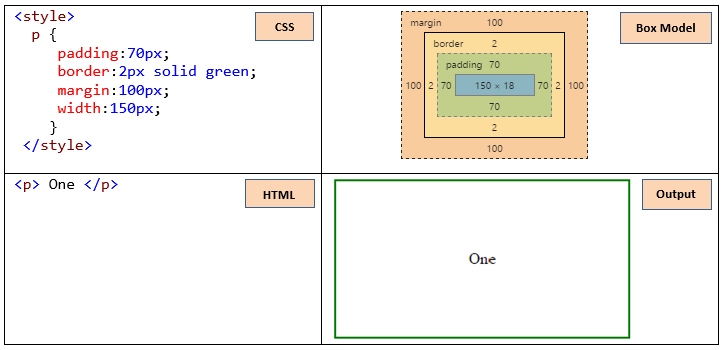

# 0. React Native + TypeScript

# Interfaces

What is the difference between: type, class, interface?

- **class:** used to create instances
- **type:** Only exist in TS
- **interface:** Only exist in TS and is most easy to expand that Type.
  - The main goal of interfaces is to tell TS what my objects look like.
  - Create validation rules to objects

# 1. Install and config react Native with emulator and devices

## Diff between Expo CLI & ReactNative CLI. Command line Interface - CLI

**Positive Points**

| Expo CLI                                         | ReactNative CLI                                           |
| ------------------------------------------------ | --------------------------------------------------------- |
| Handle IOS and Android Builds                    | Generate a minimal need for run                           |
| Provider of many native functionalities          | Generate IOS and Android independents native folder       |
| Is perfect to beginners mobile developers        | Allow write native code by Platform ( Objective C, Swift) |
| Allow run and proof the App in IOS without a Mac |                                                           |

- Expo CLI have the **EJECT** like eject script in create-react-app
- **Don't do EJECT**
  - If you will public your App in App Stores
  - If are you unhappy with native code
  - You will enjoy the future Expo updates
  - If you use Expo Push notifications services
  - If you depend of Expo community

**Negative Points**

| Expo CLI                                             | ReactNative CLI                                   |
| ---------------------------------------------------- | ------------------------------------------------- |
| You can't extends a native App don't Expo support ir | You need dev environments. Android Studio y Xcode |

**Commons positive Points**

| Expo CLI & React Native CLI          |
| ------------------------------------ |
| Many packages supported by Expo & RN |
| Hot reload supported                 |
| Dev and see upload in physic devices |

We will use react Native CLI because:

- Deep learning in RN
- Work with Xcode & Android Studio
- Handle native modules
- To know how to config and install everything

# 2. Flex, Position, Box model

## 2.1 Box Object Model



1. Height
2. Width
3. Margin
4. Border
5. Padding
6. Content

| Margin Property  | Description                           |
| ---------------- | ------------------------------------- |
| margin           | Apply 4 side margin                   |
| marginLeft       | Apply left side margin                |
| marginRight      | Apply right side margin               |
| marginBottom     | Apply bottom side margin              |
| marginTop        | Apply top side margin                 |
| marginVertical   | Apply top and bottom side same margin |
| marginHorizontal | Apply left and right side same margin |

| Padding Property  | Description                            |
| ----------------- | -------------------------------------- |
| padding           | Apply 4 side padding                   |
| paddingLeft       | Apply left side padding                |
| paddingRight      | Apply right side padding               |
| paddingBottom     | Apply bottom side padding              |
| paddingTop        | Apply top side padding                 |
| paddingVertical   | Apply top and bottom side same padding |
| paddingHorizontal | Apply left and right side same padding |

| Border Property   | Description               |
| ----------------- | ------------------------- |
| borderWidth       | Apply 4 side border width |
| borderLeftWidth   | Apply left side border    |
| borderRightWidth  | Apply right side border   |
| borderBottomWidth | Apply bottom side border  |
| borderTopWidth    | Apply top side border     |
| borderColor       | Apply color on demand     |

### Height, Width: perceptual and screen dimensions

- **How I get dimensions device?**  
   You can get the application window's width and height using [Dimension](https://reactnative.dev/docs/dimensions) :

  ```js
  import { Dimensions } from "react-native";

  const windowWidth = Dimensions.get("window").width;
  const windowHeight = Dimensions.get("window").height;
  ```

- **How I get dimensions device? (rotate the screen)**
  Using [useWindowDimensions hook](https://reactnative.dev/docs/usewindowdimensions), it automatically updates width and height values when screen size changes.

  ```js
  import { useWindowDimensions } from "react-native";

  const { height, width } = useWindowDimensions();
  ```

Example to get a View have always the 20% of screen, no matter updates width and heights...

```js
import React from "react";
import {
  SafeAreaView,
  StyleSheet,
  View,
  Text,
  useWindowDimensions,
} from "react-native";

export const DimensionsScreen = () => {
  const { width, height } = useWindowDimensions();
  return (
    <SafeAreaView>
      <View style={styles.container}>
        <View
          // Here! ========================
          style={{
            ...styles.purpleBox,
            width: width * 0.2,
          }}
          // Here! ========================
        />
        <View style={styles.orangeBox} />
      </View>
      <Text style={styles.title}>
        W: {width}H:{height}
      </Text>
    </SafeAreaView>
  );
};

const styles = StyleSheet.create({
  container: {
    width: "100%",
    height: 500,
    backgroundColor: "green",
  },
  purpleBox: {
    backgroundColor: "#5856D6",
    // width: '50%',
    height: "50%",
  },
  orangeBox: {
    backgroundColor: "#F0A23B",
    width: "50%",
    height: "50%",
  },
  title: {
    fontSize: 30,
    textAlign: "center",
  },
});
```

## 2.2 Position

> No matter where are you, the component always have position relative by Dad component.

1. **Relative:** All components have this position by default. The axis are the starting point.

   | Property | Positive Number | Negative Number |
   | -------- | --------------- | --------------- |
   | Top      | move ↓          | move ↑          |
   | Left     | move →          | move ←          |
   | Right    | move ←          | move →          |
   | Bottom   | move ↑          | move ↓          |

2. **Absolute:** Properties are relative on Dad component.
   - Top
   - Left
   - Right
   - Bottom

> Shortcut: To cover all view.

```js
greenBox: {
    // position: 'absolute',
    // bottom: 0,
    // left: 0,
    // top: 0,
    // right: 0,+

    ...StyleSheet.absoluteFillObject,
  },

```

## 2.3 Flex box

1. Direction
2. Location
3. Alignment
4. Stretch
5. Shrink
6. Proportions
